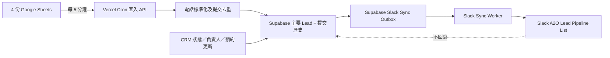

# A2O CRM → Slack Lead Pipeline 自動同步設計規格

**日期：** 2026-08-09

**狀態：** 已確認設計，程式及測試已實作；待套用 Supabase migration 及 Vercel／Slack 環境設定後啟用。Health／retry endpoint 已採 server secret 保護；由於現有 CRM 登入只在瀏覽器保存旗標，未新增不安全的 client-side 健康狀態請求。

**目標系統：** A2O Style Lab CRM、Supabase、Google Sheets、Slack List

**選定方案：** Vercel Cron + Supabase Outbox

## 1. 背景與問題

目前 CRM「廣告新客」頁面可以顯示來自四份 Google Sheet 的客人，Slack 頻道亦會收到部分 CRM Bot 訊息，但 Slack `#a2o-leads` 內的 **A2O Lead Pipeline** List 並沒有可靠地建立或更新最新 Lead。

已確認的現況：

- Google Sheet 有最新客人資料。
- CRM「廣告新客」頁面能讀取最新客人。
- Slack 頻道訊息可由 `A2O CRM Bot` 發送。
- Slack Lead Pipeline List 沒有完整同步最新客人及狀態。
- 現有網站程式庫內沒有完整的 Slack List 同步邏輯。

本功能要把 CRM／Supabase 定義為唯一資料來源，將 Lead 資料單向同步到 Slack。Slack 只供團隊查看及跟進，不可反向修改 CRM。

## 2. 核心目標

1. 新客完成 Google Form 或網站表格後，最遲 5 分鐘內出現在 CRM／Supabase 及 Slack Lead Pipeline。
2. CRM 更改客人狀況、跟進同事或預約時間後，Slack 應立即收到更新，不必等待下一個 5 分鐘週期。
3. 一個電話號碼只對應一個主要 Lead，Slack List 不產生重複項目。
4. 同一客人多次填表時，必須保留每次提交歷史。
5. Slack 暫時故障時不能影響 CRM 儲存；服務恢復後須自動補回同步。
6. 不改動現有 CRM 登入系統、既有客戶資料或其他 CRM 頁面。

## 3. 非目標

本階段不包括：

- Slack → CRM 的雙向同步。
- 在 Slack 直接更改客人狀況或跟進同事。
- 重寫現有 CRM、登入系統或其他客戶資料表。
- 刪除現有 `ad_lead_tracking`、預約資料表或舊資料。
- 建立大型同步管理後台。
- 自動判斷銷售金額或客人電郵。
- 改動 Google Form 本身。

## 4. 已確認的產品規則

### 4.1 唯一資料來源

- **Supabase 是 Lead、跟進狀態、負責同事及預約資料的唯一資料來源。**
- Google Sheets 是外部提交來源，不是 CRM 狀態的主資料庫。
- Slack 是只讀營運視圖，不是資料來源。
- Slack 同步失敗不得回滾或阻止 Supabase 儲存。

### 4.2 Lead 身分及重複提交

- 一個標準化電話號碼等於一個主要 Lead。
- 以下格式須視為同一電話：
  - `98690911`
  - `+85298690911`
  - `p:+85298690911`
  - 含空格、括號或連字號的等價格式
- 同一電話再次提交時：
  - 不建立第二個主要 Lead。
  - 建立一筆新的提交歷史。
  - 更新主要 Lead 的最新姓名、最新來源、最新 Tag 及最新提交時間。
  - 不覆蓋現有客人狀況、跟進同事或預約資料。
- 不同電話即使姓名相同，仍是不同 Lead。
- 無法安全標準化的電話不可與其他 Lead 合併，須標記為需要人工檢查。

### 4.3 時效

- Google Sheet 新客匯入：每 5 分鐘執行一次。
- CRM 狀態／負責同事／預約更新：Supabase 寫入成功後立即排入 Slack 同步。
- 「立即」指正常情況下數秒至約 1 分鐘；Slack 限流或服務故障除外。

## 5. 系統架構



### 5.1 執行元件

1. **Vercel Cron 匯入端點**
   - 每 5 分鐘讀取四份 Google Sheet。
   - 驗證 `CRON_SECRET`。
   - 標準化資料並寫入 Supabase。

2. **Supabase canonical Lead 資料**
   - 保存主要 Lead。
   - 保存所有原始提交歷史。
   - 保存 Slack 項目對應 ID 及同步狀態。

3. **Supabase Outbox**
   - 任何需要反映到 Slack 的變更都先寫入 Outbox。
   - CRM 寫入及 Outbox 建立須在同一資料庫交易內完成。

4. **Slack Sync Worker**
   - 原子方式領取待處理 Outbox 工作。
   - 建立或更新 Slack List item。
   - 支援冪等、合併、重試、限流及 dead-letter。

## 6. 建議資料模型

實作前須先檢查現有 migration 及欄位，名稱可按現有慣例微調，但不可改變以下語意。

### 6.1 `ad_leads`

主要 Lead 表，一個標準化電話只可有一筆。

| 欄位 | 類型／限制 | 用途 |
|---|---|---|
| `id` | `uuid primary key` | 穩定 Lead ID |
| `normalized_phone` | `text unique not null` | 去重鍵；不含顯示格式 |
| `display_phone` | `text not null` | CRM／Slack 顯示電話 |
| `name` | `text not null` | 最近一次有效姓名 |
| `current_status` | enum/text not null | 客人狀況 |
| `owner` | enum/text not null | 跟進同事 |
| `latest_source` | `text` | 最近來源 Form |
| `latest_tag` | `text` | 最近 Tag |
| `first_submitted_at` | `timestamptz` | 第一次提交時間 |
| `latest_submitted_at` | `timestamptz` | 最近提交時間 |
| `appointment_at` | `timestamptz null` | 預約日期及時間 |
| `needs_review` | `boolean default false` | 無法安全處理資料時標記 |
| `slack_list_item_id` | `text null` | Slack List item 穩定對應 |
| `slack_last_synced_version` | `bigint null` | 最近已同步版本 |
| `slack_last_synced_at` | `timestamptz null` | 最近成功同步時間 |
| `sync_version` | `bigint not null default 1` | Slack-facing 資料變更版本 |
| `created_at` | `timestamptz` | 建立時間 |
| `updated_at` | `timestamptz` | 更新時間 |

允許的 `current_status`：

- `未聯絡`（新 Lead 預設）
- `WhatsApp 跟進中`
- `已預約`
- `已拒絕`

允許的 `owner`：

- `terry`
- `ryan`（新 Lead 預設）
- `martin`
- `caren`
- `new`

### 6.2 `ad_lead_submissions`

每次 Google Sheet／網站提交均保存一筆，不能因主要 Lead 合併而刪除。

| 欄位 | 類型／限制 | 用途 |
|---|---|---|
| `id` | `uuid primary key` | 提交 ID |
| `lead_id` | `uuid foreign key` | 對應主要 Lead |
| `source_key` | `text unique not null` | 來源列冪等鍵 |
| `source_form` | `text not null` | 來源 Form |
| `source_tag` | `text null` | Tag |
| `source_spreadsheet_id` | `text null` | Google Sheet ID |
| `source_sheet_name` | `text null` | Sheet tab 名稱 |
| `source_row_number` | `integer null` | 原始列號，如來源可提供 |
| `submitted_name` | `text` | 當次提交姓名 |
| `submitted_phone` | `text` | 當次原始電話 |
| `normalized_phone` | `text` | 當次標準化電話 |
| `submitted_at` | `timestamptz not null` | 填表時間 |
| `payload_checksum` | `text not null` | 防止同一內容重複匯入 |
| `raw_payload` | `jsonb` | 必要原始欄位；避免保存無關敏感資料 |
| `imported_at` | `timestamptz` | 匯入時間 |

`source_key` 優先使用穩定來源識別，例如：

```text
{spreadsheet_id}:{sheet_name}:{row_number}
```

若 Apps Script 未能提供穩定列號，則使用來源、標準化電話、提交時間及內容 checksum 建立確定性 key。不得使用每次隨機 UUID 作匯入去重鍵。

### 6.3 `slack_sync_outbox`

| 欄位 | 類型／限制 | 用途 |
|---|---|---|
| `id` | `uuid primary key` | 工作 ID |
| `lead_id` | `uuid foreign key` | 要同步的 Lead |
| `event_type` | `text` | 第一版固定 `lead_upsert` |
| `target_version` | `bigint` | 要同步的 Lead 版本 |
| `status` | enum/text | `pending`、`processing`、`completed`、`failed`、`dead_letter` |
| `attempt_count` | `integer default 0` | 已嘗試次數 |
| `next_attempt_at` | `timestamptz` | 下一次可嘗試時間 |
| `locked_at` | `timestamptz null` | Worker lease |
| `locked_by` | `text null` | Worker 識別 |
| `last_error_code` | `text null` | 簡化錯誤代碼 |
| `last_error_message` | `text null` | 已遮蔽敏感資料的錯誤摘要 |
| `created_at` | `timestamptz` | 建立時間 |
| `completed_at` | `timestamptz null` | 完成時間 |

同一 `lead_id` 同時只應有一個有效的 `pending/processing` upsert。新版本出現時更新 `target_version`，避免短時間內重複同步舊狀態。

## 7. 電話標準化規則

標準化函式必須在伺服器端集中實作，Google 匯入、CRM API 及 backfill 共用同一邏輯。

處理順序：

1. trim 前後空白。
2. 移除已知前綴，例如 `p:`、`tel:`。
3. 移除空格、括號及連字號。
4. 將香港本地 8 位電話補為 `852XXXXXXXX`。
5. 將 `+852XXXXXXXX`、`00852XXXXXXXX` 正規化為 `852XXXXXXXX`。
6. 保留非香港國際國碼，但必須通過合理長度驗證。
7. 不確定、過短、含 URL 或明顯不是電話的值不得與其他 Lead 合併。

顯示格式建議：

- 香港電話：`+852 XXXXXXXX`
- 其他國際電話：`+{country_code}{number}`

Log 只可顯示遮蔽格式，例如 `+852 ****2646`。

## 8. Google Sheet 匯入流程

### 8.1 來源

沿用現有四份來源及指定 tab，不讀取同一 spreadsheet 內其他工作表：

- Men New Form
- Style Lab New Form
- A2O Style Lab
- A2O Website

實作模型須以現有 `AdLeadInbox.gs` 及 `/api/ad-leads` 的設定為準，不可憑名稱重新猜 spreadsheet ID 或欄位位置。

### 8.2 每輪 Cron

1. 驗證 `CRON_SECRET`。
2. 取得分散式 lease，防止兩次 Cron 同時匯入。
3. 讀取四份來源；單一來源故障不應令其他三份完全失敗。
4. 對每筆資料建立 `source_key`、checksum 及標準化電話。
5. 在交易內：
   - upsert submission；
   - 建立或更新主要 Lead；
   - 只有 Slack-facing snapshot 改變時增加 `sync_version`；
   - 建立或合併 Outbox 工作。
6. 記錄每個來源的成功、失敗、新增、更新及略過數量。
7. 釋放 lease。
8. 觸發或接續處理一批 Outbox；如超出執行時間，餘下工作由下一輪繼續。

### 8.3 主要 Lead 更新優先次序

再次提交只可更新：

- 最近一次非空姓名
- `latest_source`
- `latest_tag`
- `latest_submitted_at`

不得更新：

- `current_status`
- `owner`
- `appointment_at`
- CRM 人工補充資料

`first_submitted_at` 永遠保存最早時間。

## 9. CRM 即時更新流程

現有 CRM 更新狀態、負責同事或預約時間的 API，必須改為在同一資料庫交易中：

1. 驗證登入及輸入。
2. 更新 canonical `ad_leads`。
3. 增加 `sync_version`。
4. 建立或合併 `slack_sync_outbox` 工作。
5. 提交交易。
6. 回應 CRM 成功。
7. 非阻塞觸發 Slack Worker；即使即時觸發失敗，Outbox 仍由下一輪 Cron 補回。

不得在瀏覽器前端直接呼叫 Slack API。

## 10. Slack Lead Pipeline 欄位對照

目標 List：Slack `#a2o-leads` 內的 **A2O Lead Pipeline**。

| Slack 欄位 | Supabase 來源 | 規則 |
|---|---|---|
| Lead／客人 | `name` + `latest_source` | 建議顯示 `💬 {name}｜{latest_source}` |
| 客人狀況／階段 | `current_status` | 精確對應四個狀態 |
| 跟進同事／交易負責人 | `owner` | 由環境設定的 Slack User ID mapping 對應 |
| 電話號碼 | `display_phone` | 可點擊 `tel:`（如 Slack List 欄位支援） |
| WhatsApp | `normalized_phone` | `https://wa.me/{normalized_phone}` |
| 來源 Form | `latest_source` | 最近一次提交來源 |
| Tag | `latest_tag` | 最近一次提交 Tag；沒有則留空 |
| 最近填表日期 | `latest_submitted_at` | 以 Asia/Hong_Kong 顯示 |
| 預約日期及時間 | `appointment_at` | 空值時留空；以 Asia/Hong_Kong 顯示 |

以下現有 Slack 欄位保留但不自動填入：

- 預計方案金額
- 電子郵件地址

### 10.1 狀態對應及後續步驟

如 Slack List 保留「後續步驟」欄，按狀態產生：

- `未聯絡`：`首次聯絡客人，了解主要形象問題及合適諮詢時間。`
- `WhatsApp 跟進中`：`了解客人主要痛點、目的及場合；提供簡單分析，再邀請預約。`
- `已預約` 且有時間：`已預約：{香港日期及時間}`
- `已預約` 但沒有時間：`已標記為已預約，待補充預約時間。`
- `已拒絕`：`客人暫不考慮；保留記錄，不再主動跟進。`

### 10.2 Owner mapping

程式不可按顯示名稱搜尋 Slack 使用者。使用 Vercel secret／environment JSON 明確對應：

```json
{
  "terry": "SLACK_USER_ID",
  "ryan": "SLACK_USER_ID",
  "martin": "SLACK_USER_ID",
  "caren": "SLACK_USER_ID",
  "new": "SLACK_USER_ID"
}
```

實際 ID 不得提交到 GitHub 文件或程式碼。

## 11. Slack upsert 及防重複

### 11.1 建立

- `slack_list_item_id` 為空時才建立 Slack item。
- 建立成功後立即把 item ID 保存至 `ad_leads`。
- 若 Slack 建立成功但回寫 Supabase 前連線中斷，重試前須先按穩定識別檢查既有項目，避免建立第二項。

### 11.2 更新

- 有 `slack_list_item_id` 時直接更新對應項目。
- Slack 項目被人工刪除或 ID 無效時：
  1. 記錄 `item_not_found`；
  2. 以標準化電話／保存的外部識別查找一次；
  3. 找到則修復 mapping；
  4. 找不到才重建一項。

### 11.3 版本保護

- Worker 讀取 `target_version` 後，永遠從 `ad_leads` 取得最新 snapshot。
- 成功後將實際同步版本寫入 `slack_last_synced_version`。
- 若處理期間有新版本產生，保留或新增 pending 工作，直至 Slack 追上最新版本。
- 已完成的舊版本不得覆蓋較新的 Slack 狀態。

## 12. Outbox Worker、併發及重試

### 12.1 Claim

- 使用資料庫 transaction 加 `FOR UPDATE SKIP LOCKED` 或等價 RPC 原子 claim。
- 每次處理固定小批量，例如 20 筆。
- `processing` 工作須有 lease timeout；Worker 中斷後可重新 claim。
- 同一 Lead 不可由兩個 Worker 同時更新 Slack。

### 12.2 重試

建議基礎排程：

1. 第一次失敗：1 分鐘後
2. 第二次：5 分鐘後
3. 第三次：15 分鐘後
4. 第四次：1 小時後
5. 其後指數延長，上限 6 小時
6. 連續 8 次失敗：`dead_letter`

Slack `429` 必須遵守 `Retry-After`，不得使用較短重試時間。

以下錯誤可重試：

- timeout
- 429
- Slack 5xx
- 臨時網絡錯誤

以下錯誤通常不可直接重試，應進入明確錯誤狀態：

- token 無效
- 權限不足
- List ID／欄位 ID 設定錯誤
- 無法映射的必要 Slack 欄位

修正設定後，管理員可重新排入 dead-letter 工作。

## 13. 安全與私隱

### 13.1 Vercel Environment Variables

至少需要：

- `CRON_SECRET`
- `SUPABASE_URL`
- 伺服器專用 Supabase credential
- `SLACK_BOT_TOKEN`
- `SLACK_LEAD_PIPELINE_LIST_ID`
- Slack List field IDs／mapping
- `SLACK_OWNER_USER_MAP`
- 現有 Google Apps Script URL 及 read secret

實際 secret 不得寫入：

- GitHub
- migration
- 瀏覽器 bundle
- Log
- 本設計文件

### 13.2 API 權限

- Cron endpoint 驗證 Vercel Cron header／`CRON_SECRET`。
- Slack Worker 只可由伺服器內部或已驗證 Cron 呼叫。
- 同步狀態及手動重試只供已登入 CRM 管理員使用。
- Supabase RLS／server role 必須遵從現有安全架構；不可為方便同步而公開資料表。

### 13.3 Log

允許記錄：

- `lead_id`
- source 名稱
- outbox ID
- 錯誤代碼
- 遮蔽電話
- 執行數量及耗時

禁止記錄：

- 完整電話號碼
- 客人完整 raw payload
- Slack Token
- Google／Supabase secret

## 14. 資料遷移及上線策略

### 14.1 不破壞舊資料

- 保留現有 `ad_lead_tracking`、預約資料表及其資料。
- 保留 CRM 客戶資料、登入資料及其他頁面。
- 不直接 drop、truncate 或覆蓋舊表。

### 14.2 Backfill

1. 建立新表及索引。
2. 從四份 Google Sheet 匯入所有可用提交歷史。
3. 按標準化電話建立主要 Lead。
4. 將現有 tracking 狀態及 owner 合併到主要 Lead。
5. 將現有預約合併到主要 Lead。
6. 產生核對報告：
   - 原始提交數
   - 唯一有效電話數
   - 主要 Lead 數
   - 無效／待檢查電話數
   - 各狀態數量
   - 各 owner 數量
7. 核對無誤後，CRM 讀取 canonical table。
8. 首次 Slack backfill 採限速批次執行，避免 API 限流。

### 14.3 Cutover

- 先在 preview deployment 使用測試 Slack List 或 dry-run 驗證 payload。
- 正式 List 同步前先備份／匯出現有 Slack List item mapping。
- 切換後觀察至少一個完整 5 分鐘週期及一次 CRM 即時更新。
- 舊資料表只標記為 legacy；未經另一次明確批准不可刪除。

## 15. 監察與管理功能

目前以受保護的 server endpoint 提供同步狀態及重試能力，不改動現有
CRM 登入系統。因為現有後台登入只在瀏覽器保存 `localStorage` 旗標，不能
直接當作 server authentication；因此 `PortalAdLeads` 不會把未授權的
client-side page password 轉發到 health／retry endpoint。日後如要在頁面
顯示狀態，須先加入真正的 server-side staff session 或受保護 proxy。

Health endpoint 回傳：

```json
{
  "last_import_at": "...",
  "last_slack_sync_at": "...",
  "pending_count": 0,
  "processing_count": 0,
  "dead_letter_count": 0,
  "sources": [
    {"name": "Men New Form", "status": "ok"}
  ]
}
```

Health endpoint 不得回傳姓名、電話或原始客人資料。

## 16. 測試要求

### 16.1 單元測試

- 香港電話不同格式標準化為相同值。
- 國際電話保留正確國碼。
- URL、空值及無效電話標記為待檢查。
- `source_key` 及 checksum 具確定性。
- 狀態、owner 及 Slack 欄位 mapping 正確。
- Retry delay 及 429 `Retry-After` 正確。

### 16.2 資料庫／整合測試

- 新電話建立一個主要 Lead 及一筆 submission。
- 同一電話第二次提交：主要 Lead 仍一筆，submission 變兩筆。
- 第二次提交更新來源／Tag／最新日期，但不覆蓋 status、owner、appointment。
- 重跑相同 Google 資料不增加 submission。
- CRM 更新及 Outbox 建立具交易一致性。
- 兩個 Worker 同時執行不重複 claim。
- 舊版本不能覆蓋新版本。
- processing lease 過期可安全重試。

### 16.3 Slack adapter 測試

- 建立新 item payload 正確。
- 更新既有 item 不建立新 item。
- item not found 可修復 mapping 或重建。
- 429、5xx、timeout 正確重試。
- invalid token／missing scope 進入可診斷錯誤。
- Owner 使用 Slack User ID mapping，不靠名字搜尋。

### 16.4 端到端驗收

1. 四份來源各加入一筆 synthetic test Lead。
2. 5 分鐘內 CRM 及 Slack 出現對應項目。
3. 同電話再次提交，Slack 仍只有一項，最近來源及日期更新。
4. CRM 將狀態改為 `WhatsApp 跟進中`，Slack 即時更新。
5. 更改 owner，Slack 負責人正確更新。
6. 建立預約，Slack 預約時間及狀態正確更新。
7. 模擬 Slack 失敗，確認 CRM 儲存成功且 Outbox 保留。
8. 恢復 Slack，確認自動補回同步。
9. 確認現有 CRM 登入、客戶頁面及其他功能沒有 regression。

測試資料必須使用合成姓名及電話，不可使用真實客人資料。

## 17. 驗收標準

只有全部符合才可視為完成：

- 新 Lead 在正常情況下最遲 5 分鐘出現在 Slack List。
- CRM 人工更新通常在 1 分鐘內反映到 Slack。
- 同一標準化電話在 Supabase 及 Slack 只有一個主要 Lead／List item。
- 多次提交歷史可查閱且不遺失。
- Google 匯入、Cron 重跑、Worker 重試均不產生重複資料。
- Slack 故障不影響 CRM 儲存，恢復後可補同步。
- 所有已確認 Slack 欄位正確映射。
- 未收集的金額及 Email 保持空白。
- Secrets 不在 Git、client bundle 或 Log 出現。
- 現有 CRM 登入、CRM 客戶資料及其他頁面不受影響。
- Migration 及 rollback 步驟已在 preview 環境驗證。

## 18. Rollback 原則

若正式同步出現問題：

1. 停用 Vercel Cron／Slack Worker，不停止 CRM 核心寫入。
2. 保留 Outbox 及所有 canonical Lead 資料。
3. CRM 可暫時切回現有讀取邏輯。
4. 不刪除已建立的新資料表或提交歷史。
5. 修正後重新處理 pending／failed 工作。
6. Slack 已重複的項目必須先產生核對清單，經人工確認後才合併或移除。

## 19. 實作模型必須先確認的現有資源

開始寫程式前，實作模型必須實際讀取並核對：

- `app/api/ad-leads.ts`
- `app/api/ad-lead-tracking.ts`
- `app/api/_lib/adLeadTracking.ts`
- `app/api/_lib/adLeadAppointments.ts`
- `app/integrations/google-apps-script/AdLeadInbox.gs`
- Supabase migration 目錄及現有 tracking／appointment schema
- CRM「廣告新客」頁面及其資料 hook
- `vercel.json`／現有 Vercel Cron 設定
- 現有環境變數文件

不得假設現有欄位名稱、Slack List field ID、Google Sheet ID 或 Slack User ID。必須從實際環境或安全設定取得。

## 20. 建議實作次序

本文件不是實作授權；以下只用作後續建立 implementation plan：

1. 補測試及電話標準化工具。
2. 建立 canonical tables、outbox、索引及安全 policy。
3. 建立 backfill／核對工具。
4. 將 Google Sheet 匯入改為寫入 Supabase。
5. 將 CRM update 改為交易式建立 Outbox。
6. 實作 Slack List adapter 及欄位 mapping。
7. 實作 Outbox Worker、retry、lease 及 dead-letter。
8. 加入 Vercel Cron 及安全環境變數。
9. （可選後續）在加入 server-side staff session 後，再加入簡潔同步狀態 UI。
10. Preview dry-run、Slack 測試 List、正式 backfill、cutover 及監察。

---

**重要：** 本規格只批准設計文件。未獲使用者另行指示前，不得執行 migration、修改程式、設定 Slack／Vercel、push implementation commit 或部署。
